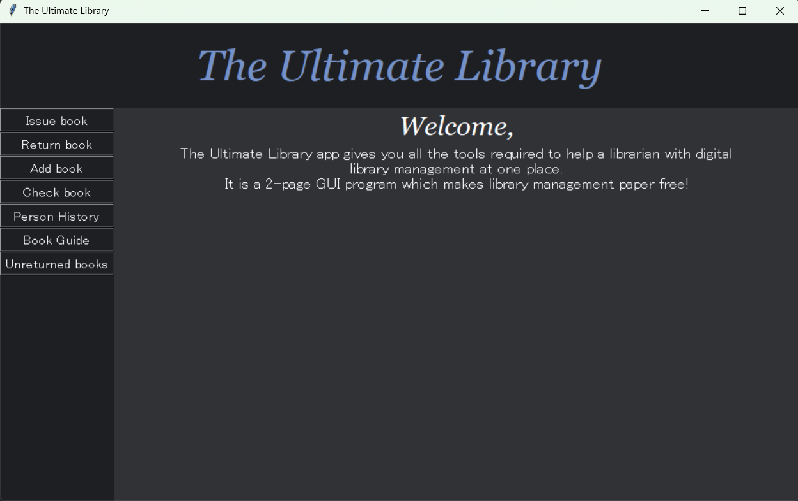
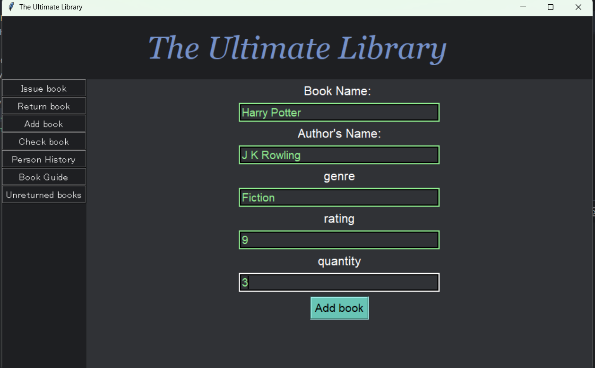
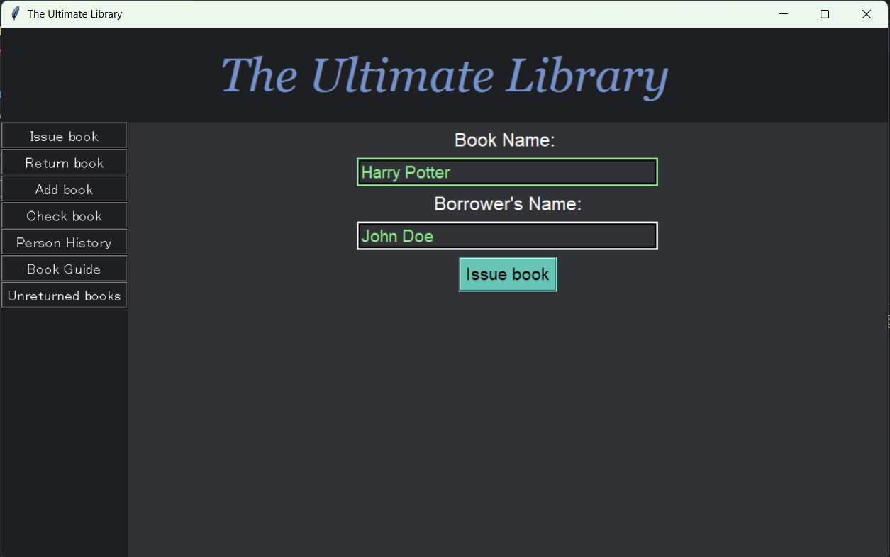
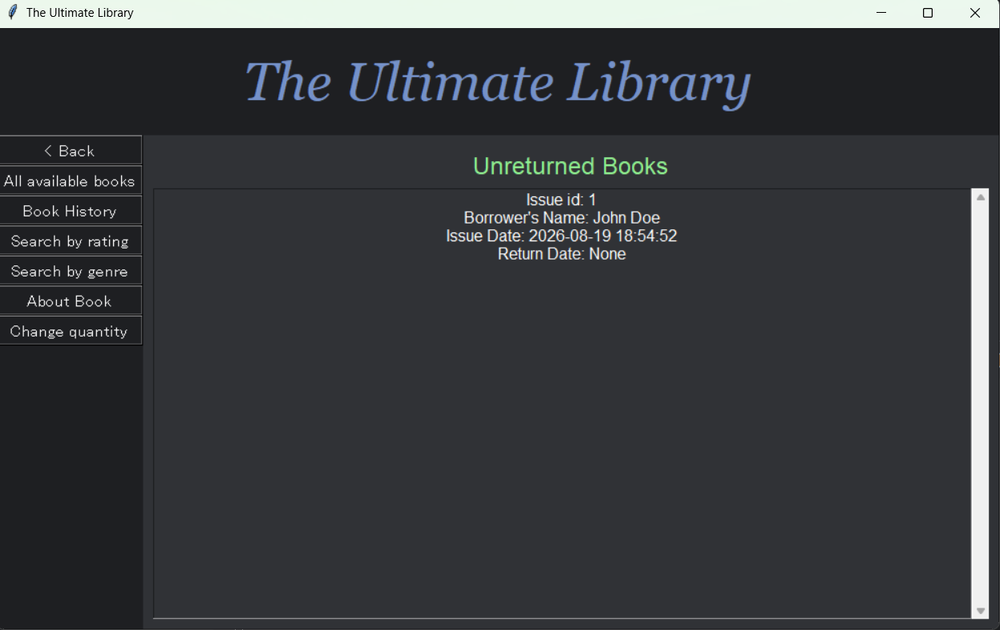

# The Ultimate Library

A complete GUI application for digital library management with a vintage aesthetic. Handles book inventory, borrowing records, and patron history - making library operations completely paperless.

> A retro-styled desktop app that brings charm to library management!

## Screenshots

### Home Screen


### Add Book


### Issue Book


### Unreturned Books


## Features

### Book Management
- **Add Books** - Add new books with title, author, genre, rating, and quantity
- **Check Availability** - See if a book is available to borrow
- **Change Quantity** - Update stock levels for existing books
- **Book Details** - View complete information about any book

### Borrowing System
- **Issue Books** - Track who borrowed which book and when
- **Return Books** - Record returns and update availability
- **Unreturned Books** - See all books not yet returned
- **Person History** - View complete borrowing history of any patron
- **Book History** - See who borrowed a book and when

### Search & Discovery
- **Search by Genre** - Find all books in a specific genre
- **Search by Rating** - Find books within a rating range
- **Available Books List** - Browse all books currently in stock

## Design

The app features a **vintage, retro-styled UI** with:
- Dark color scheme (#1E1F22, #303236)
- Elegant Georgia font for headings
- Calm, library-like aesthetic
- Responsive design that works on different screen sizes
- Intuitive dark-mode interface

### Two-Page Navigation

The sidebar navbar dynamically switches between two main pages:

**Page 1 - Main Operations:**
- Issue book
- Return book
- Add book
- Check book availability
- Person History
- Book Guide (gateway to page 2)
- Unreturned books

**Page 2 - Book Guide:**
Comprehensive book browsing and discovery with:
- All available books list
- Book History (who borrowed what)
- Search by rating range
- Search by genre
- Book details & information
- Change book quantity
- Back button to main page

This two-page navigation keeps the interface clean and organized!

## Tech Stack

- **Language:** Python 3
- **GUI:** Tkinter (built-in)
- **Database:** SQLite (built-in)
- **No external dependencies required!**

## Architecture

### `main.py` - GUI Frontend
- Tkinter-based graphical interface
- Organized navigation system
- Input forms and data display
- Alert/notification system

### `funcs.py` - Backend Logic (UltimateLib)
The `UltimateLib` class handles all library operations:

**Database Management:**
- `issue_book` - Record book borrowing
- `return_book` - Record book returns and update quantities
- `add_book` - Add new books to inventory
- `change_book_quantity` - Update stock levels

**Search & Query:**
- `search_by_genre` - Find books by genre
- `search_by_rating` - Find books by rating range
- `b_availability` - Check if book is available
- `available_books` - List all available books

**History & Tracking:**
- `person_history` - Get borrowing history of a person
- `book_history` - Get all borrowing records of a book
- `unreturned_books` - List books not yet returned

**Data Access:**
- `about_book` - Get detailed book information
- `check_book` - Verify if book exists

### Database Schema

**books_detail table:**
- id, book_name, author_name, rating, genre, quantity

**issue_book table:**
- id, person, book, issue_date, return_date

## Installation

```bash
# No external dependencies to install!
# Python 3.6+ comes with sqlite3 and tkinter built-in

# Clone the repo
git clone https://github.com/yourusername/ultimate-library.git
cd ultimate-library

# Run the application
python main.py
```

## Requirements

- **Python 3.6+**
- **tkinter** (built-in with Python)
- **sqlite3** (built-in with Python)

See `requirements.txt` (no external packages needed)

## How to Use

1. Run the application
2. Choose options from the navbar on the left
3. Enter required information in input fields
4. View results or confirmations in alerts/info panels

### Main Navigation

- **Issue book** - Lend a book to someone
- **Return book** - Record a book return
- **Add book** - Add new book to library
- **Check book** - See if book is available
- **Person History** - View borrowing history of a person
- **Book Guide** - Access book-related operations
- **Unreturned books** - See overdue books

## Project Structure

```
ultimate-library/
├── main.py             # Main GUI application (Tkinter)
├── funcs.py            # UltimateLib backend logic
├── lib1.db             # SQLite database
└── README.md
```

## Skills Demonstrated

- GUI development with Tkinter
- Database operations (SQLite)
- Event handling and callbacks
- Object-oriented programming
- Data validation and management

---

**Created through active learning to explore GUI development, database management, and building complete desktop applications from scratch.**
